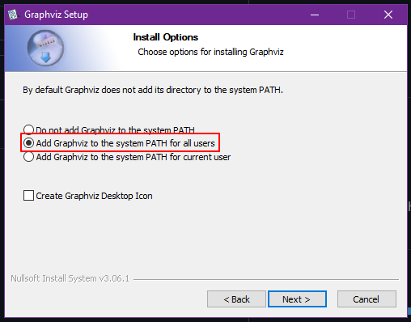

# Sliding Puzzle Solver using traditional search
## [Try it out in Web Here](https://flet-sliding-puzzle.fly.dev/)
## [Sample output](./Source.gv.pdf)
## Setup Instructions
1. Install [graphviz](https://gitlab.com/api/v4/projects/4207231/packages/generic/graphviz-releases/7.0.4/windows_10_cmake_Release_graphviz-install-7.0.4-win64.exe), and add it to system PATH
   </br>
2. Install Pipenv, or conda/mamba etc.
    </br>```pip install pipenv```
3. Install project environment & dependencies
   </br>```pipenv install```

## Running the Project
1. cd to project dir.
2. Switch to project venv
   </br>```pipenv shell```
3. run it!!!
   </br>```python main.py``` 
#### or
2. run the prject directly through pipenv
   </br>```pipenv run python main.py```